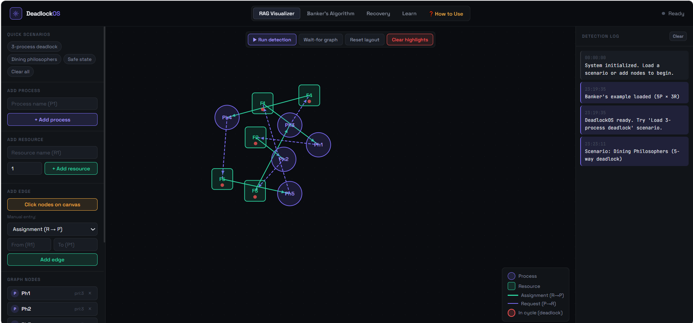
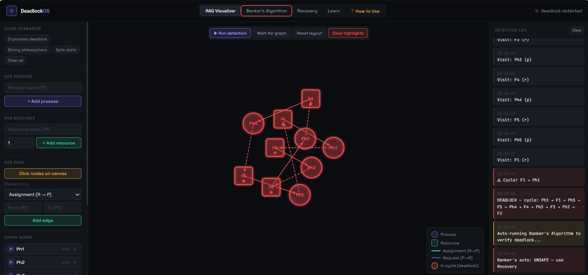
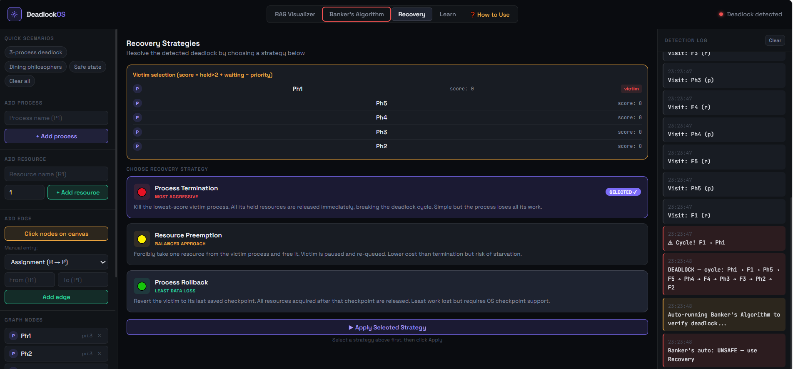
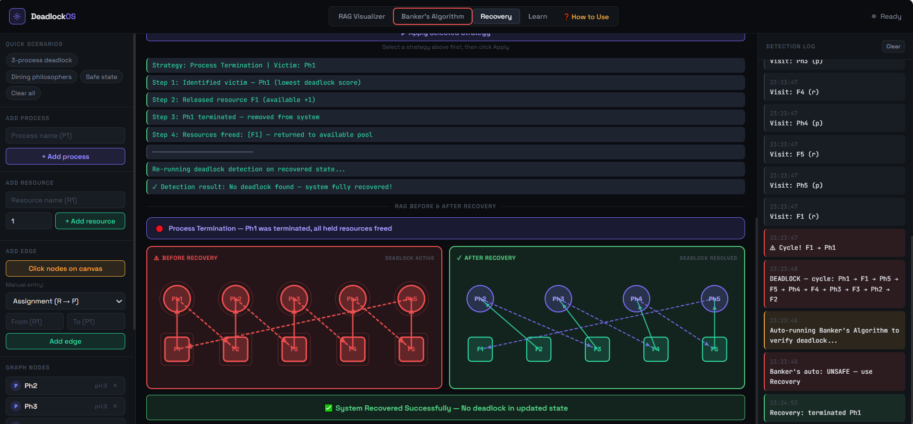
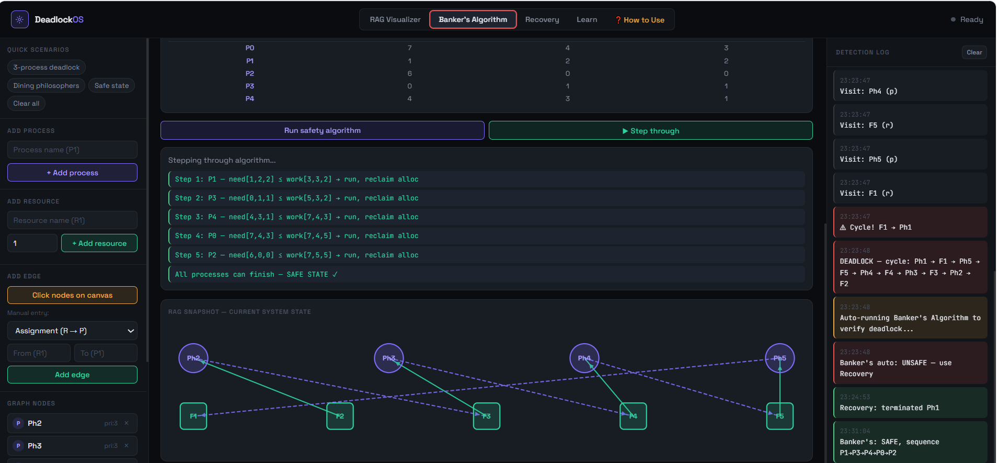

# deadlock-detection-recovery-system

> A web-based interactive system for detecting, avoiding, and recovering from deadlocks in operating system environments — built as a course project for BS Computer Science at Salim Habib University.

---

## About

Deadlock is one of the most critical challenges in concurrent operating system environments — it occurs when a group of processes are permanently blocked, each waiting for a resource held by another. Without active detection and recovery, deadlocked systems remain frozen indefinitely.

This project addresses the problem through a fully interactive **Resource Allocation Graph (RAG) Visualizer** with three core deadlock-handling strategies built in.

---

## Live Demo

🔗 [Click here to view the live project](https://armeenmubeen.github.io/deadlock-detection-recovery-system)

> 

---

## Features

- **Deadlock Detection** — Resource Allocation Graph cycle analysis and Wait-for Graph reduction
- **Deadlock Avoidance** — Banker's Algorithm safety checks with safe sequence computation
- **Deadlock Recovery** — Process termination and resource preemption strategies
- **Interactive RAG Visualizer** — manually construct resource allocation scenarios or load predefined configurations
- **Before & After Visualization** — shows the graph state before and after deadlock resolution
- **Multiple Scenario Testing** — tested across deadlock and non-deadlock configurations

---

## Screenshots







---

## Technologies Used

| Layer | Technology |
|-------|-----------|
| Frontend | HTML, CSS, JavaScript |
| Algorithm | Banker's Algorithm, Cycle Detection, Wait-for Graph |
| Concepts | Operating Systems, Process Scheduling, Resource Management |
| Tool | Visual Studio Code |

---

## Project Structure

```
deadlock-detection-recovery-system/
├── project/          # Source code and project files
├── report/           # Full project report (PDF)
├── ppt/              # Presentation slides
└── README.md
```

---

## How It Works

1. User constructs a Resource Allocation Graph by adding processes and resources
2. System runs cycle detection to identify deadlocked processes
3. Banker's Algorithm checks if the current state is safe
4. If deadlock is detected, recovery options are presented (terminate process / preempt resource)
5. Graph updates visually to show the resolved state

---

## Course Details

| | |
|---|---|
| Course | Operating Systems |
| Degree | BS Computer Science |
| University | Salim Habib University, Karachi |
| Semester | Spring 2026 |
| Supervisors | Miss Mahjabeen Tahir · Sir Salman Khan |

---

## Team

| Name | Student ID |
|------|-----------|
| Armeen Mubeen | S24CSC009 |
| Syed Rameez Hassan | S24CSC045 |
| Muntasha Samoo | S24CSC011 |
| Mahnoor Motiwala | S24CSC027 |

---

## Keywords

`operating-systems` `deadlock` `banker-algorithm` `resource-allocation-graph` `wait-for-graph` `process-recovery` `concurrency` `cycle-detection` `java` `computer-science`
